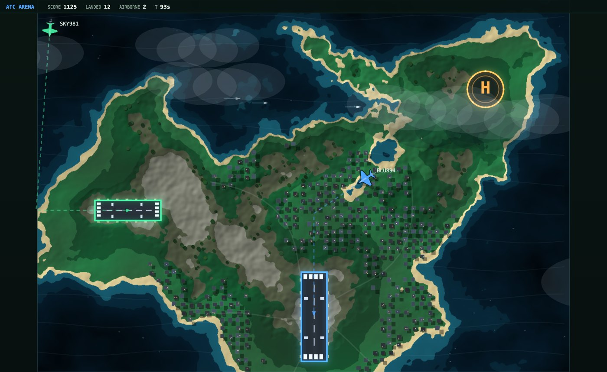

# ATC Arena

A real-time air traffic control game you can play with a mouse — and train a
reinforcement learning agent to play on the exact same interface.



Draw a flight path from an aircraft to its matching landing zone. Jets take the
blue runway, props the green one, helicopters the amber pad. Two aircraft
touching is game over. The spawn rate ramps up with every landing, so the run
ends when the traffic beats you.

The agent and the human drive the **same public API** — there is no private path
into the engine, so a policy is playing the game you play, not a simplified
version of it.

---

## Quick start

Requires Python 3.13 and [uv](https://docs.astral.sh/uv/).

```bash
git clone https://github.com/tirukovelamanoj/ATC.git && cd ATC
uv venv --python 3.13
uv pip install -e .
.venv/bin/python -m uvicorn atc.arcade.server:app --port 8099
```

Open <http://127.0.0.1:8099> and press **NEW GAME**. Click and drag from an
aircraft to draw its route — the aircraft follows the line you drew exactly.


The map is generated per game: simplex-noise elevation banded into biomes and
hillshaded, with a flat plateau forced under every landing zone so a runway can
never appear in the sea.

---

## Train an agent

The game doubles as a Gymnasium environment. The policy sees the map as a small
grid and picks one cell per decision: *where should this aircraft go next.*

```bash
uv pip install -e ".[train]"          # adds gymnasium, stable-baselines3, torch (~2.5GB)

python -m atc.arcade.bench            # scripted baseline, ~25 landings
python -m atc.arcade.train --steps 4000000 --envs 8 --shaping 0.05
python -m atc.arcade.evaluate runs/ppo_grid.zip --episodes 25
```

Training is CPU-only and needs no GPU — the observation is an 8x14x20 grid, far
too small to profit from one. The simulator runs at ~156,000 steps/s single
core, so the neural network is the bottleneck, not the game.

### Scores to beat

| controller | landings | notes |
|---|---|---|
| random | 0.88 | picks cells at random |
| aim at the zone | 6.16 | flies straight at the target zone |
| `GreedyRouter` | 24.87 | scripted, routes once per aircraft |
| **aim + runway alignment** | **30.96** | the bar — hand-coded, re-decides continuously |

None of these avoids conflicts. That is the headroom: an agent that spaces
traffic should clear 30.96 comfortably.

### How the environment is shaped

```
  OBSERVATION  Box(8, 14, 20)              ACTION  Discrete(280)
  8 channels over the same grid            one cell = the next waypoint
   selected aircraft · heading sin/cos      the env expands it into the same
   other traffic · their paths              polyline a mouse would draw
   target zone · all zones · conflicts
```

Input and output share a grid on purpose: a convolutional policy is then
translation-equivariant, so *"avoid the aircraft two cells north-east"*
generalises across the whole map instead of being memorised per location.

Emitting one cell at a time — rather than painting a whole route — keeps every
action valid. Multi-leg routes emerge from repeated decisions, and the training
signal is far denser.

### Latency

A deployed agent talks over a network. Train with the delay simulated:

```bash
python -m atc.arcade.train --steps 4000000 --delay-max 40   # up to 2s, randomised
```

Measured cost of latency for the hand-coded bar:

| action delay | landings |
|---|---|
| 0 | 27.6 |
| 1.0s | 17.2 |
| 2.0s | 10.6 |

Do **not** train against a live server. The game advances at 20 ticks per *real*
second there, versus 156,000 steps/s locally — about 7,800x slower, and network
jitter makes runs non-reproducible. Train locally with simulated delay; use the
live server to evaluate.

---

## Two engines

| | `src/atc/` (graph) | `src/atc/arcade/` (active) |
|---|---|---|
| Control | route / clear-to-land / hold | free-form drawn paths |
| Loss condition | fuel exhaustion, separation | mid-air collision |
| Agents | LLM leagues, timed plans | RL over a spatial action map |
| Run | `uvicorn atc.server:app` | `uvicorn atc.arcade.server:app` |

The arcade engine is the game. The graph engine came first, is kept intact, and
is the only one where human-vs-agent scores are strictly comparable — a human
draws with a mouse while an agent emits exact coordinates, which is different
input bandwidth on the same task. Agent-vs-agent comparison is sound on both.

`atc-arena-spec.md` is the original design document.

## Layout

```
src/atc/arcade/
├── engine.py      the simulation. the only place game rules live
├── server.py      FastAPI + WebSocket; also serves the UI
├── web/           canvas client (no framework, no WebGL)
├── gym_env.py     Gymnasium wrapper, spatial action map
├── train.py       PPO + small CNN
├── evaluate.py    policy vs the scripted bars
├── bots.py        scripted baselines
└── bench.py       baseline sweep
configs/           every rule constant. nothing is hardcoded in the simulator
tests/             determinism invariant for the graph engine
```

## Tuning without touching code

Everything in `configs/arcade_m1.json` is live: aircraft speeds and turn rates,
spawn ramp, zone positions and colours, collision radii, scoring, map size.

```jsonc
"speed_multiplier": 1.0,      // wall-clock only; game time is unchanged
"join_style": "immediate",    // or "procedure_turn" for a banked Dubins join
"heading_slew_deg_s": 540     // how fast a sprite swings to face its travel
```

## Not built yet

- Submitting a trained policy to a hosted instance for live evaluation
- ONNX export + a "watch the AI play" mode in the browser
- Deployment config (Dockerfile, hosting)

## License

MIT — see `LICENSE`.

## Credits

`web/vendor/simplex-noise.js` — simplex-noise 2.4.0, MIT, (c) 2018 Jonas Wagner.
Vendored rather than CDN-linked so the game runs offline. Everything else is
first-party: the terrain, aircraft, runways and effects are drawn with plain
Canvas 2D.
