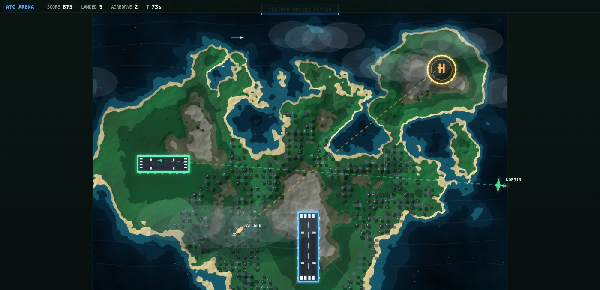

<div align="center">

# ATC Arena

**A real-time air traffic control game that a human plays with a mouse
and a reinforcement learning agent plays over the same API.**

[](https://game.manojtirukovela.com)
[](https://www.python.org/)
[](https://gymnasium.farama.org/)
[](https://onnx.ai/)
[](LICENSE)

[Play](https://game.manojtirukovela.com) ·
[Quick start](#quick-start) ·
[Train](#train-an-agent) ·
[Bring your own agent](#bring-your-own-agent) ·
[Deploy](#deploying)


</div>

Draw a flight path from an aircraft to its matching zone. Jets take the blue
runway, props the green one, helicopters the amber pad. Two aircraft touching
ends the run, and the spawn rate ramps with every landing.

There is **no private path into the engine** — the agent and the human drive the
same public API, so a policy is playing the game you play, not a simplified
version of it.

---

## Quick start

```bash
git clone https://github.com/tirukovelamanoj/ATC.git && cd ATC
uv venv --python 3.13 && uv pip install -e .
.venv/bin/python -m uvicorn atc.arcade.server:app --port 8099
```

Open <http://127.0.0.1:8099> → **NEW GAME**. Click and drag from an aircraft;
it follows the line you drew exactly.


## Features

- **Free-form path drawing** — arc-length traversal, so aircraft sit exactly on
  the polyline rather than steering toward it
- **Gymnasium environment** over the identical engine, no simulation fork
- **Spatial action map** — one logit per grid cell, ~58k weights at any resolution
- **ONNX serving** — the hosted server flies a trained policy without PyTorch
- **Procedural terrain** — simplex-noise elevation, biome banding, hillshading,
  with a flat plateau forced under every zone so runways never land in the sea
- **Plays over HTTP/WebSocket** — your model runs on your machine, never uploaded

## Train an agent

```bash
uv pip install -e ".[train]"          # gymnasium, stable-baselines3, torch (~2.5GB)

python -m atc.arcade.bench            # scripted baseline
python -m atc.arcade.train --steps 4000000 --envs 8 --grid-w 40 --grid-h 28 --shaping 0.05
python -m atc.arcade.evaluate runs/ppo_grid.zip --grid-w 40 --grid-h 28
```

| | |
|---|---|
| Observation | `Box(0, 1, (8, 28, 40), float32)` |
| Action | `Discrete(1120)` — one grid cell |
| Reward | `+1` per landing, `-1` on collision |
| Episode end | terminated on collision, truncated at `max_decisions` |

The policy is **fully convolutional**: a 1x1 conv emits one logit per cell, so it
has ~58k weights at *any* grid size — 20x14 and 40x28 use the identical network.
A flattened dense head would cost 18M weights at 40x28 and would not be
resolution-independent.

Input and output share a grid on purpose. A convolutional policy is then
translation-equivariant, so *"avoid the aircraft two cells north-east"*
generalises across the map instead of being memorised per location.

### Scores to beat

25 episodes from seed 500, 40x28 grid, no action delay. Comparing across grid
sizes is meaningless, so every row uses one. Numbers live in
`configs/baselines.json`, read by the server, `evaluate.py` and the docs page.

| controller | landings |
|---|---|
| random | 0.80 |
| aim at the zone | 5.64 |
| `GreedyRouter` | 24.87 |
| aim + runway alignment | 29.08 |
| **trained policy** | **33.68** |

The network clears the hand-coded bar, but **not** by understanding traffic:
blank every other aircraft out of its observation and only 0.7% of its decisions
change. That is the open headroom.

### Latency

A deployed agent talks over a network, so train with the delay simulated:

```bash
python -m atc.arcade.train --steps 4000000 --delay-max 40   # up to 2s, randomised
```

| action delay | landings |
|---|---|
| 0 | 27.6 |
| 1.0s | 17.2 |
| 2.0s | 10.6 |

> [!WARNING]
> Do **not** train against a live server. It advances at 20 ticks per *real*
> second versus ~156,000 steps/s locally — about 7,800x slower — and jitter makes
> runs non-reproducible. Train locally with simulated delay; evaluate live.

## Bring your own agent

No clone needed. Three files, three packages:

```bash
curl -O https://game.manojtirukovela.com/v1/agent.py
curl -O https://game.manojtirukovela.com/v1/spatial.py
curl -o policy.onnx https://game.manojtirukovela.com/v1/policy.onnx
pip install numpy websockets onnxruntime

python agent.py --server https://game.manojtirukovela.com
```

It prints a `/?watch=g_7f3a` link anyone can open to watch your agent fly live.

Swap in your own model by replacing one class:

```python
class MyBrain:
    gw, gh = 40, 28                   # the fixed 8x28x40 input

    def decide(self, obs) -> int:     # obs: float32 (8, 28, 40)
        ...                           # return a cell index, 0..1119
```

torch, JAX or five lines of `if` — the server neither knows nor cares.

### API

| | |
|---|---|
| `POST /v1/games` | create; returns `game_id`, `config`, `state` |
| `WS /v1/games/{id}/stream` | a state snapshot every tick, 20/s |
| `POST /v1/games/{id}/path` | your action: a polyline, flown exactly |
| `GET /v1/games/{id}/state` | one snapshot, if you would rather poll |
| `POST /v1/games/{id}/abort` | end a run and free the slot |
| `GET /v1/spec` | the whole contract as JSON |
| `GET /v1/policy.onnx` | reference weights (234KB) |
| `GET /v1/agent.py` | the example client |
| `GET /v1/spatial.py` | the observation encoder |
| `GET /docs` | Swagger |

> [!IMPORTANT]
> `/v1/spatial.py` serves **the same file the server imports**, not a copy. The
> trainer, the hosted pilot and your agent all call that one `build_obs(...)`, so
> your encoding cannot drift from the one the policy was trained on.

**Your model stays on your machine.** The simulation is server-side, so scores
and seeds are the server's — which is what makes them comparable.

## Deploying

```bash
docker build -t atc-arena .
docker run -p 8000:8000 atc-arena
```

449MB on disk, ~60MB resident under load. The image carries the game, the config
and the exported policy — but not torch, which is why it stays small.

**Sizing is CPU, not memory.** Every game is a live 20Hz task. Measured as
sim-seconds per wall-second (1.0 = keeping real time) with AI games, the worst case:

| instance | 2 games | 4 games | 8 games |
|---|---|---|---|
| 0.10 vCPU (free tier) | 0.94x | 0.71x | 0.24x |
| 0.25 vCPU (eco-micro) | 1.00x | 1.00x | 0.33x |
| 0.50 vCPU (eco-small) | 1.00x | 1.00x | 0.52x |

~0.06 vCPU per game. An overloaded event loop does not shed load, it runs the sim
in slow motion for *everyone*, so the cap must match real capacity. Past it the
server returns 429 with `Retry-After`. Abandoned games free themselves after 60s
of no contact — a WebSocket or any HTTP call counts, so a polling agent is not
mistaken for a closed tab.

| env var | default | |
|---|---|---|
| `ATC_MAX_GAMES` | `4` | concurrent games before 429 |
| `ATC_LOG_LEVEL` | `INFO` | `DEBUG` adds a line per drawn path |
| `PORT` | `8000` | injected by most platforms |

> [!NOTE]
> Single instance only — games live in process memory, so a second replica would
> strand players whose WebSocket lands on the wrong one. Set `min = max = 1`.
> Avoid free tiers: 0.1 vCPU degrades at two concurrent AI games, and scale-to-zero
> means a cold start for most visitors to a portfolio link.

On Koyeb: point a service at the repo (it builds the Dockerfile), health check
`/health`, attach your domain. WebSockets and TLS work out of the box; the client
picks `wss://` automatically over HTTPS.

## Configuration

Everything in `configs/arcade_m1.json` is live — speeds, turn rates, spawn ramp,
zone positions and colours, collision radii, scoring, map size. Nothing is
hardcoded in the simulator.

```jsonc
"speed_multiplier": 1.0,      // wall-clock only; game time is unchanged
"join_style": "immediate",    // or "procedure_turn" for a banked Dubins join
"heading_slew_deg_s": 540     // how fast a sprite swings to face its travel
```

## Watch a trained policy



```bash
python -m atc.arcade.export_onnx runs/ppo_v2.zip --out models/policy.onnx
uv pip install -e ".[ai]"          # onnxruntime, ~50MB
```

Press **WATCH AI** in the browser. `models/policy.onnx` is a single
self-contained file (~234KB) and inference is ~0.2ms on CPU, so serving needs no
GPU and no torch. The export verifies the ONNX graph picks the same action as
torch on 200 random observations — without that check a deployed agent can
silently play a different policy than the one you evaluated.

## Project layout

```
src/atc/arcade/
├── engine.py       the simulation. the only place game rules live
├── server.py       FastAPI + WebSocket; also serves the UI
├── web/            canvas client (no framework, no WebGL)
├── spatial.py      THE observation encoder — one copy, three callers
├── gym_env.py      Gymnasium wrapper, spatial action map
├── train.py        PPO + small CNN
├── export_onnx.py  torch checkpoint -> single self-contained .onnx
├── evaluate.py     policy vs the scripted bars
├── bots.py         scripted baselines
└── bench.py        baseline sweep
configs/            every rule constant, plus baselines.json
examples/agent.py   remote client; runs standalone from downloaded files
models/policy.onnx  the served policy, 234KB
tests/              determinism invariant for the graph engine
```

<details>
<summary><b>Two engines, and why both are kept</b></summary>

<br>

| | `src/atc/` (graph) | `src/atc/arcade/` (active) |
|---|---|---|
| Control | route / clear-to-land / hold | free-form drawn paths |
| Loss condition | fuel exhaustion, separation | mid-air collision |
| Agents | LLM leagues, timed plans | RL over a spatial action map |
| Run | `uvicorn atc.server:app` | `uvicorn atc.arcade.server:app` |

The arcade engine is the game. The graph engine came first, is kept intact, and
is the only one where human-vs-agent scores are strictly comparable — a human
draws with a mouse while an agent emits exact coordinates, which is different
input bandwidth on the same task. Agent-vs-agent comparison is sound on both.

`atc-arena-spec.md` is the original design document.

</details>

## Roadmap

- [ ] A policy that actually avoids conflicts — the current one ignores the traffic channels
- [ ] Submitting a trained policy to a hosted instance for live evaluation
- [ ] Persisting games outside process memory (needed before scaling past one replica)

## License

MIT — see [LICENSE](LICENSE).

<details>
<summary>Credits</summary>

<br>

`web/vendor/simplex-noise.js` — simplex-noise 2.4.0, MIT, (c) 2018 Jonas Wagner.
Vendored rather than CDN-linked so the game runs offline. Everything else is
first-party: terrain, aircraft, runways and effects are drawn with plain Canvas 2D.

</details>
